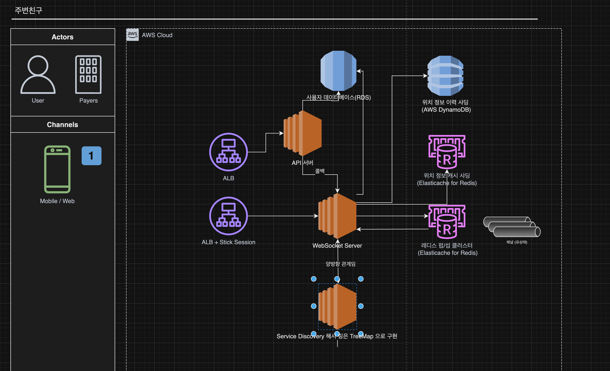

목표: 앱 사용자 가운데 위치 정보 접근 권한을 허락한 사용자에 한해 인근의 친구 목록을 보여주는 백엔드 시스템 구축

1장에서 배운 근접성 서비스와의 차이점 -> 위치정보의 정적이냐 동적이냐의 차이

# 문제 이해 및 설계 범위 확정

- 어느정도 가까워야 하나? -> 기본적으로 8km 이내, 하지만 사용자가 설정 가능해야함.
- 거리는 사용자간의 직선거리로 계산 (사용자간의 디테일한 거리 계산은 불필요)
- 앱사용자는 10억명, 이 기능을 사용하는 유저는 10%라고 가정
- 사용자의 이동 기록은 보관. 추후 기계 학습을 위해
- 친구 관계에 있는 사용자가 10분 이상 비활성화 시 지도상에서 표시하지 않도록 함.
- GDPR, CCPA 은 일단 생략.
- 평균적으로 한 사용자는 400명의 친구를 갖는다 가정
- 친구 위치는 30초마다 갱신

## 기능 요구사항

- 모바일 앱에서 주변 친구를 확인 가능.
- 주변 친구 목록에는 친구까지의 거리, 마지막 갱신시각이 함께 표시

## 비기능 요구사항.

- 주변 친구의 위치가 갱신되는 시간이 너무 오랜시간이 걸리지 않아야 함.
- 전반적으로 시스템이 안정적이어야 하지만 때론 몇개의 데이터가 유실되어도 괜찮음.
- 강한 일광성을 지원하는 데이터베이스는 필요 없음. 결과적 일관성만 지원하면 됨.

> 강한 일관성을 가지는 데이터베이스 : GCP Spanner [Spanner에서 강한 일관성을 제공하나요?](https://cloud.google.com/spanner/docs/true-time-external-consistency?hl=ko#strong-consistency)
> 결과적 일관성을 가지는 데이터베이스 : Cassandra, DynamoDB

# 개략적 설계안 제시 및 동의 구하기

## 개략적 설계안

### P2P 방식

1. 사용자는 근방의 모든 활성 상태 친구의 새 위치정보를 수신해야함.
2. P2P 방식으로 해결가능한
   단점: 통신 연결상태가 좋지않은경우, 사용할 수 있는 전력도 충분치 않음.

### 공용 백엔드 서버 방식

1. 모든 사용자의 위치 변화를 수신해야함.
2. 위치 변화를 수신할 때마다 해당 사용자의 모든 활성 상태 친구를 찾아서 변경내역을 전파.
3. 전파할 때 특정 임계치 보다 먼 경우에는 변경 내역을 전달하지 않음.

천만명이 30초마다 갱신한다고 했을 때 334,000번 위치 갱신 API 호출이 발생, 평균 400명의 친구이며 그 중 10%만 활성화 되어있다고 가정하면
334,000 * 400 * 0.1 = 13,360,000번의 API 호출이 발생함.

단점: 서버의 부하.

결론: 백엔드 우선 소규모로 시작해보자.

- 로드밸런서
- API 서버
- 위치 정보 캐시(레디스)

레디스 항목중에 TTL 설정을 통해 10분이상 비활성화된 사용자는 삭제하도록 설정.

- 사용자 데이터베이스
- 위치 이동 이력 데이터베이스
- 웹 소켓 서버

실시간 통신을 위해서 사용, 클라이언트의 초기화 담당.

- 레디스 펍/섭

메세지 브로커 구현체중 하나이다.

1. 모바일 클라이언트가 위치가 변경된 사실을 로드밸런서에 전송
2. 웹소켓 서버를 통해 수신한 특정 사용자의 위치 정보 변경 이벤트를 위치 이동 이력 데이터베이스에 저장.
3. 위치 정보 변경 이벤트를 레디스에 저장. -> TTL 업데이트
4. 위치 정보 변경 이벤트를 해당 사용자에게 배정된 펍/섭 채널에 발행.
5. 해당 사용자의 친구들은 해당 채널의 구독자로 설정되어있음.
6. 웹소켓 연결 핸들러가 호출됨
7. 이벤트를 수신할 친구가 활성상태면 거리를 계산
8. 계산 거리가 검색 반경 이내면 갱신 위치와 갱신 시각을 클라이언트로 전송

> 사용해본적 있는 RabbitMQ와 비교
>
> RabbitMQ
> - 메시지 전달 보장 (Guaranteed Delivery)
> - 메시지 지속성 (Persistence) 지원
> - 메시지 확인 (Acknowledgment) 메커니즘 제공
> - 실패 시 재전송 기능 제공
> - 상대적으로 더 많은 리소스 사용
>
> Redis Pub/Sub
> - 메시지 전달 보장 없음
> - 메시지 지속성 없음 (휘발성)
> - 메시지 확인 메커니즘 없음
> - 재전송 기능 없음
> - 매우 높은 처리량
> - 단순한 구조로 인한 낮은 지연시간
> - 가벼운 리소스 사용

### API 설계

일반적인 친구 추가, 삭제 사용자 정보 갱신 API 는 생략

**웹 소켓 서버의 API**

[ServerApi]:

- 웹소켓 초기화 API
- 본인 위치 정보 갱신 API

[ClientApi]:

- 친구 위치 정보 갱신 API
- 새 친구 구독 API
- 친구 구독 해제 API

### 데이터 모델

[위치 정보 캐시]

활성 상태 친구의 가장 최근 위치를 보관.
Redis Key Value 를 통해서 구현

위치 정보에 데이터베이스를 사용하지 않는 이유?

- "현재 위치" 만을 이용
- TTL 을 통해서 자동제거 가능.

[위치 이동 이력 데이터베이스]

user_id, latitude, longitude, timestamp 로 구성
샤딩이 쉬운 구조로 이루어져있음.
카산드라 DB 를 활용하도록

### 데이터 모델

[위치 정보 캐시]

활성 상태 친구의 가장 최근 위치를 보관.
Redis Key Value 를 통해서 구현

위치 정보에 데이터베이스를 사용하지 않는 이유?

- "현재 위치" 만을 이용
- TTL 을 통해서 자동제거 가능.

[위치 이동 이력 데이터베이스]

user_id, latitude, longitude, timestamp 로 구성
샤딩이 쉬운 구조로 이루어져있음.
카산드라 DB 를 활용하도록

# 상세 설계

## 중요 구성 요소별 규모 확장성

### API 서버

생략

### 사용자 데이터베이스 및 위치 정보 캐시(레디스)

부하분산 -> 샤딩 처리
가용성 -> 복제본 처리
사용자 ID 기준으로 샤딩 가능

### 웹소켓 서버

- 유상태 서버

  > AWS ALB 에서 WSS, WS 지원, Sticky Session 설정, idle 타임 고려(기본 60초)

- 서버를 제거할 때 추가적인 연결이 맺어지지 않게 Draining 시키고
  기존 연결이 끊기길 시간이 흐른뒤 서버를 제거

  > AWS Target Group Connection Draining

### 클라이언트 초기화

1. 클라이언트가 초기화되면 웹소켓 서버에 사용자의 위치정보 전송
2. 본인 위치 정보 캐시 업데이트
3. 사용자 데이터베이스로부터 친구목록 조회
4. 친구들의 위치정보 캐시 조회
5. 본인과 친구들 데이터들을 계산하여 클라이언트에 반환
6. 웹소켓 서버는 각 친구들의 레디스 서버 펍/섭 채널을 구독.
   > 활성 친구 사용자의 채널만 구독하는게 아니라 모든 친구의 채널을 구독하는 이유?
   >
   > 채널을 유지하는데는 메모리가 필요한것은 사실이지만 비용이 소량이고 활성화가 되기 전까지는 CPU, I/O 리소스를 사용하지
   > 않는다.
7. 레디스 펍/섭

    1. 채널을 만드는 비용이 저렴.
    2. 구독자가 없는 채널로 보내는 메시지는 그대로 버려짐. 이 때 부하는 거의 없다.
    3. 구독자 관계를 유지하기 위한 해시 테이블과 연결 리스트가 필요한데 아주 소량의 메모리
    4. 오프라인 사용자라 어떤 변경도 없는 채널의 경우 생성된 이후 CPU 자원을 전혀 사용하지 않음.

   4번의 특징으로 모든 친구의 채널을 구독한다.
   이렇게 되면 활성상태, 비활성 상태의 채널을 유지, 삭제하는 아키텍처비용을 줄일 수 있음.

8. 얼마나 많은 레디스 펍/섭이 필요할까?
    - 메모리
   > 주변 친구 기능을 사용하는 유저 = 1억 => 1억개의 채널
   > 1인당 활성친구 100명, 해시 테이블과 연결리스트에 20바이트 사용
   > 1억 * 100 * 20 = 200GB
    - CPU
   > 펍/섭 서버가 클라이언트에 위치정보 전송 업데이트 양 = 1400만건/초
   > 기가비트 네트워크 카드 서버 한대감당 가능한 구독자 수 = 100,000
   > 1400만건/초 / 100,000 = 140대

### 분산 레디스 펍/섭 클러스터

- 메시지를 발행할 사용자 ID 기준으로 샤딩
- 하지만 장애 대비 및 매끄럽게 운영을 위해 서비스 탐색 컴포넌트를 도입 (etcd, zookeeper)

### 서비스 탐색 컴포넌트

서비스 탐색 컴포넌트 중에 다음의 기능 두가지를 사용.

1. 채널을 기준으로 레디스 펍/섭을 찾을 수 있게 해주는 해시링 기능
2. Client로 하여금 레디스 펍/섭 변경사항을 구독할 수 있도록 하는 기능

> 클러스터 내에 레디스 펍/섭 추가, 삭제, 새로 교체하는 경우

웹소켓 서버가 특정 사용자 채널에 위치 정보 변경 내역을 발행하는 과정 OR
구독할 채널이 어디 레디스 펍/섭에 존재하는지

1. 웹소켓 서버는 서비스 탐색 컴포넌트로부터 해시링을 참조하여 레디스 펍/섭을 찾음.
   > 이 때 성능 효율을 위해 캐시를 활용할 수 있으나 서비스 디스커버리에 구독 관계를 설정해서 원본을 항상 유지.
2. 해당 레디스 펍/섭에 발행

### 레디스 펍/섭 서버 클러스터의 규모 확장시 고려사항.

레디스 펍/섭 서버의 기본적인 특성.

1. 전송되는 메시지는 메모리나 디스크에 지속적으로 보관되지 않음. 구독자에게 전송되고나면 바로 삭제.
   구독자가 없는 경우는 그냥 사라짐.
   > 이 관점에서 보면 무상태 서버로 볼 수 있음.
2. 하지만 채널의 구독자 목록은 상태 정보의 핵심적 부분. 특정한 채널을 담당하는 서버가 교체되거나 사라지는 경우
   > 해당 채널의 모든 구독자에게 새로운 서버로 구독을 변경하도록 알려줘야 함.
   > 이런 특징 때문에 유상태 서버임.
>

이런 특징 때문에 규모를 늘리거나 줄이는 것은 위험 요소가 있음.
대부분 오버 프로비저닝하는것이 보통.

하지만 불가피하게 규모를 늘리는 경우 다음의 문제가 발생할 수 있음.
- 많은 채널들이 해시 링 위의 다른 여러 서버로 이동하게 됨.
- 서비스 탐색 컴포넌트는 클라이언트에게 해시링이 갱신되었음을 알림.
- 웹 소켓 서버는 많은 재구독 요청을 처리하게 됨.
- 이 때 위치 정보 변경 메시지의 처리가 누락될 가능성이 있음. 하지만 그 정도의 손실을 허용.

### 운영 고려사항.

기존 레디스 펍/섭 서버에 문제가 생겨 교체해야하는 상황.

1. 서비스 탐색 컴포넌트의 해시 링 키에 매달린 값을 갱신. 문제가 발생한 노드와 교체
2. 교체 사실은 모든 웹 소켓서버에 통보.
3. 웹 소켓 서버는 교체된 레디스 펍/섭에 있는 채널들을 새로운 레디스 펍/섭으로 구독.

### 친구 추가/ 삭제

- 친구 추가, 친구 삭제의 콜백을 웹 소켓 서버로 받음.
- 웹 소켓 서버는 해당 친구가 활성화 상태면 최근 위치 및 시각 정보를 보냄.

### 친구가 많은 사용자

- 친구는 양방향 관계라고 가정
- 최대 상한 5000

수천 명의 친구를 구독하는데 필요한 펍/섭 구독 관계는 클러스터 전체에 걸쳐 분산되어 있음.
-> 웹 소켓 서버에 분산되어있음.
많은 친구를 가진 사용자의 채널이 존재하는 레디스 펍/섭은 조금 더 많은 부하를 받을 수도 있음.

### 주변의 임의 사용자

주변의 동의를 구한 임의 사용자를 보여주는 기능을 추가해보자.

1. 지오해시에 기반한 레디스 펍/섭 채널을 만들어 둠.

### 레디스 펍/섭 대안

얼랭(Erlang) 한번 사용해보자

1. 분산 병렬 어플리케이션을 위한 언어 및 런타임 환경
2. 경량 프로세스
3. 여러 서버로 분산이 쉬움.
4. 운영 부담이 낮음, 프로덕션에서 발생하는 이슈 추적, 디버깅을 위한 도구가 훌륭

웹소켓 서버를 얼랭, 레디스 펍/섭 클러스터는 분산 얼랭 어플리케이션

# 마무리

Service Discovery 부분에서 ETCD 가 언급된 부분이 있어서
쿠버네티스를 예전에 사용했을 때 ETCD 가 생각나서 조금 살펴봤는데
분산 키, 값 저장소가 어떻게 위의 서비스 디스커버리의 기능을 만족시키는지 의문이 듬.

일반적인 Java Application 에서 TreeMap 으로 구현하면 조금 더 쉽게 구현이 되지 않을까?
라는 생각이 든다.

