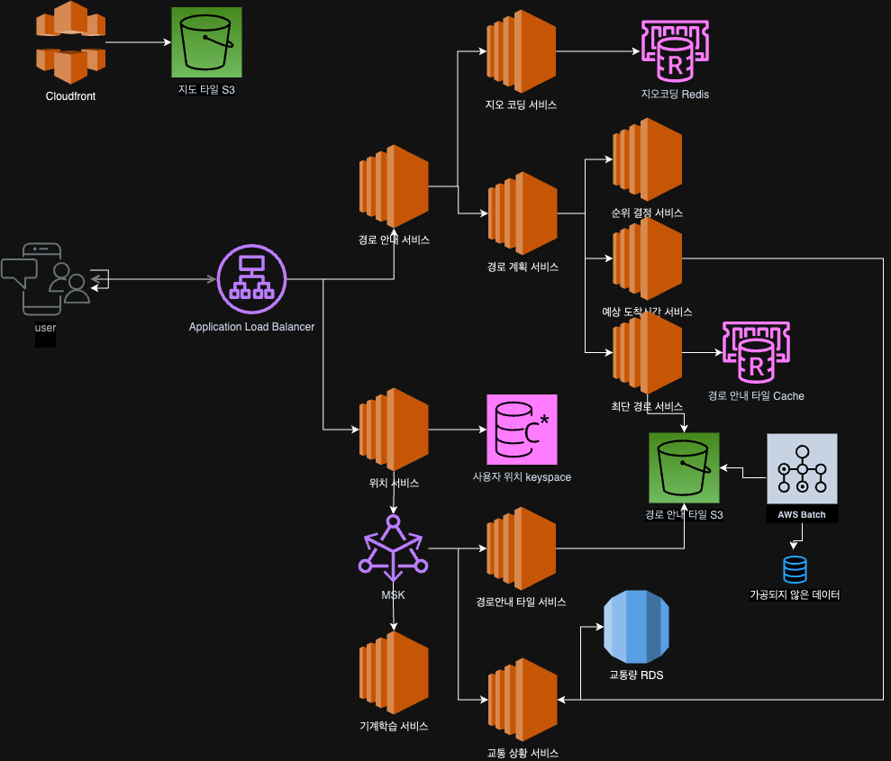

# 문제 이해 및 설계범위 확정

- 10억 DAU
- 위치 갱신, 경로 안내, ETA, 지도 표시 기능을 제공하는 서비스
- 도로 데이터는 수 TB 규모의 가공되지 않은 데이터
- 다양한 이동수단 지원

## 개념

- 웹 메르카토르
- 지오코딩 [국토교통부 지오코딩 API](https://www.data.go.kr/data/15101106/openapi.do?recommendDataYn=Y)
- 지오해싱
- 지도표시
    - 확대 수준에 따른 타일 표시
- 경로 안내 알고리즘을 위한 도로 데이터 처리 (경로 안내 타일)
    - 다익스트라 알고리즘을 일반적으로 사용
    - 도로망을 노드(교차로)와 엣지(도로)로 구성된 그래프 자료구조로 변환.
    - 하나의 도로망은 도로로 연결된 도로망을 참조관계로 유지.
    - PNG 가 아닌 이진 파일
- 계층적 경로 안내 타일
    - 구체성 정도를 상, 중, 하로 구분하여 경로 안내 타일을 준비

# 개략적 규모 추정.

## 저장소 사용량

### 세계 지도

- 한 장의 타일 256x256 픽셀 약 100KB
    - 256x256x3 = 192KB
    - 무손실 PNG 압축 -> 100KB

> 비슷한 영역이 많을 수록 압축률 높음.

- 21번 확대 가능했을 때 타일의 갯수 4^21 약 4.4조
- 100KB * 4.4조 = 440PB
- 90% 는 살지 않는 지역. 압축시 90% 감소 -> 88PB
- 모든 단계의 타일을 전부 합 약 100PB

## 서버 대역폭

요청의 종류

- 경로 안내 요청
- 위치 갱신 요청
- 경로 안내기능을 평균적으로 주당 35분
- 350억 분, 즉 하루에 50억분
- GPS 를 1초마다 전송시 하루에 3000억 요청
- 3000억 / 10^5 = 300만 QPS
- 클라이언트에서 15초마다 데이터를 모아서 보낼 시 20만 QPS
- 최대 QPS 는 다섯배로 가정하면 100만 QPS

# 개략적 설계안 제시 및 동의 구하기

## 위치 서비스

사용자의 위치를 기록하는 역할.

장점.

1. 해당 데이터 스트림을 활용해 시스템을 점차 개선 가능.

- 실시간 교통상황 모니터링
- 폐쇄된 도로 탐지.
- 개인화된 경험.

2. 최적화된 ETA 계산.

많은 쓰기 요청에 적합한 카산드라 데이터베이스.
데이터 스트림 처리를 위해 카프카 사용.

## 경로 안내 서비스

A 에서 B 지점으로 가는 합리적으로 빠른 경로를 찾아주는 역할.

## 지도 표시

1. 동적으로 타일을 만드는 방법.

- 서버 클러스터에 심각한 부하.
- 캐시를 활용하기 힘듬.

2. 미리 만들어 놓은 타일을 사용하는 방법.

- 클라이언트는 지도 타일이 필요한 경우 필요한 위치의 지오해시를 구해서 서버에 요청
- POP(Point of Presence) 에 캐시 서버를 두어서 빠르게 제공.

3. 주어진 위도/경도 및 확대 수준을 타일 URL 로 변환하는 알고리즘은 별도 서비스에 구현.

# 상세 설계

## 데이터 모델

### 경로 안내 타일

1. 원본데이터는 가공되지 않은 데이터이므로 주기적으로 데이터 가공 파이프라인을 실행하여 경로 안내 타일로 변환한다.
2. 해상도를 달리하여 3벌을 만든다.
3. 그래프에는 노드와 선분이 있으며 다른 타일의 도로와 연결되는 경우 참조 정보도 포함.
4. 메모리에 인접 리스트로 저장하는것이 일반적이나 양이 너무 많기 때문에 S3 같은 객체 저장소에 이진 파일로 직렬화 하여 보관.
5. 경로 안내 서비스에서 S3에 저장된 파일을 적절히 캐싱

```python
import pickle
import boto3
from typing import Dict, List

class Graph:
    def __init__(self):
        self.adj_list: Dict[int, List[int]] = {}
    
    def add_edge(self, u: int, v: int) -> None:
        if u not in self.adj_list:
            self.adj_list[u] = []
        if v not in self.adj_list:
            self.adj_list[v] = []
        self.adj_list[u].append(v)

def save_graph_to_s3(graph: Graph, bucket: str, key: str) -> None:
    """인접리스트를 S3에 저장"""
    # S3 클라이언트 생성
    s3_client = boto3.client('s3')
    
    # 그래프를 바이너리로 직렬화
    serialized_graph = pickle.dumps(graph.adj_list)
    
    # S3에 업로드
    s3_client.put_object(
        Bucket=bucket,
        Key=key,
        Body=serialized_graph
    )

def load_graph_from_s3(bucket: str, key: str) -> Graph:
    """S3에서 인접리스트 로드"""
    # S3 클라이언트 생성
    s3_client = boto3.client('s3')
    
    # S3에서 객체 다운로드
    response = s3_client.get_object(Bucket=bucket, Key=key)
    serialized_graph = response['Body'].read()
    
    # 바이너리를 그래프로 역직렬화
    graph = Graph()
    graph.adj_list = pickle.loads(serialized_graph)
    return graph

# 사용 예시
if __name__ == "__main__":
    # 그래프 생성
    graph = Graph()
    graph.add_edge(1번 교차로, 1번도로)
    graph.add_edge(1번 교차로, 2번도로)
    
    # S3에 저장
    save_graph_to_s3(graph, 'my-bucket', 'graphs/지오해시.pkl')
    
    # S3에서 로드
    loaded_graph = load_graph_from_s3('my-bucket', 'graphs/지오해시.pkl')
    print(loaded_graph.adj_list)
```

### 사용자 위치 데이터

도로 데이터 및 경로 안내 타일을 갱신하는데 사용.

엄청난 쓰기 연산을 잘 처리 가능해야함 -> 카산드라 DB

### 지오코딩 데이터베이스

주소를 위도/경도로 변환하는 서비스에 사용됨.
쓰기가 거의 없고 읽기만 많음 -> Redis

### 미리 만들어 둔 지도 이미지

S3 및 CloudFront를 사용하여 저장 및 전송

## 서비스

### 위치 서비스

사용자의 위치는 계속 변화하며 일단 변경되고 나면 이전 정보는 바로 무용해짐.
데이터 일관성 (Consistency) < 가용성 (Availability)

테이블 구조

Partition Key : 사용자 ID
Clustering keys : 타임스탬프

같은 파티션 키를 갖는 데이터는 함께 저장되며 클러스터링 키 값에 따라 정렬됨
-> 특정 사용자의 특정 기간내 위치도 효율적으로 읽어낼 수 있다.

| 사용자 ID | 위도     | 경도      | 타임스탬프               | 네비게이션   | 유저모드   |
|--------|--------|---------|---------------------|---------|--------|
| 1      | 37.123 | 127.123 | 2024-11-18 12:00:00 | driving | active |

> 사용자 위치는 어떻게 이용되는가?
> 데이터 스트리밍 플랫폼(카프카)을 활용하여
> 실시간 교통상황, 경로 안내타일 등 다양한 서비스를 개선할 수 있음.

### 지도 표시

> 벡터 이미지 (SVG)
> 파일 용량이 적음, 확대/축소 용이, 복잡한 영역은 렌더링이 느림
> GPU 를 선택적으로 사용가능.

### 경로 안내 서비스

1. 지오코딩 서비스: 생략
2. 경로 계획 서비스: 출발지, 목적지의 위도/경도를 받아서 K개의 최단 경로를 반환하는 서비스

"최단 경로 서비스", "순위 결정 서비스", "예상 도착 시간 서비스" 등과 통신하여 결과를 도출.

3. 최단 경로 서비스

- 출발지, 목적지의 지오해시를 계산.
- 출발지 타일을 가져와서 그래프 자료 구조를 탐색해 나감.
- 인접한 타일이 필요한 경우 객체 저장소 또는 캐시에서 가져옴.
- 이 때 해당 타일의 다른 확대 수준 타일도 가져와야함.
- 경로가 충분히 확될 떄 까지 탐색을 반복.

4. 예상 도착 시간 서비스(ETA Service)

"최단 경로 서비스" 목록을 수신하면 각 경로의 예상 도착 시간을 계산하여 반환.
기계학습을 활용해 현재 교통 상황 및 과거 이력에 근거

5. 순위 결정 서비스
   ETA 예정치를 구하면 사용자가 정의한 필터링 조건을 적용

6. 중요 정보 갱신 서비스 (카프카 스트림)
1. 실시간 교통 정보 데이터베이스
2. 경로 안내 타일

### 적응형 ETA 와 경로 안내.

경로 안내 타일의 특정 부분에서 교통사고가 발생했을 경우

user_1: r_1, r_2, r_3, ...r_k
user_2: r_4, r_6, r_7, ...r_n
user_3: r_2, r_8, r_9, ...r_m
...
user_n: r_1, r_2, r_3, ...r_l

테이블에 보관된 레코드의 수가 n, 안내 평균 길이가 m 이라 할때 교통 변화에 영향 받는 모든 사용자의
검색 시간 복잡도는 O(nm).

검색 속도를 더 높일 수 있는 방법

- 사용자 각각의 현재 경로 안내 타일, 그 타일을 포함하는 상위 타일, 그 상위 타일의 상위 타일을 출발지와 목적지가
  모두 포함된 타일을 찾을 때 까지 재귀적으로 더하여 보관.

### 전송 프로토콜

경로 안내중 상황이 변경될 때를 대비하여 다양한 프로토콜을 사용할 수 있다.

- 모바일 푸시 알람
    - 웹 지원 X
    - 데이터의 크기가 제한적
- 롱 폴링
- 웹소켓
- SSE

[GNN](https://medium.com/watcha/gnn-%EC%86%8C%EA%B0%9C-%EA%B8%B0%EC%B4%88%EB%B6%80%ED%84%B0-%EB%85%BC%EB%AC%B8%EA%B9%8C%EC%A7%80-96567b783479)


