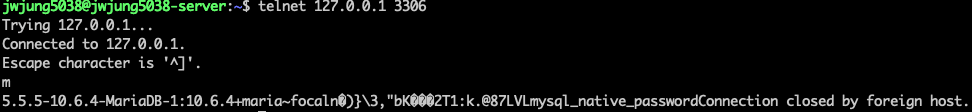

일반적으로 mysql 설치시 mysqld 라고 불리는 서버 프로그램과 mysql-client 프로그램이 같이 설치됩니다.
이 중 mysql-client 는 DB 접속 프로그램으로 접속을 해서 작업을 수행할 수 있습니다.

하지만 mysql-client 같은 프로그램이 설치하지 않고 네트워크 상황만 확인하고 싶을 때가 있습니다.

## nc (netcat)
```shell
nc 127.0.0.1 3306
```


## telnet
```shell
telnet 127.0.0.1 3306
```

