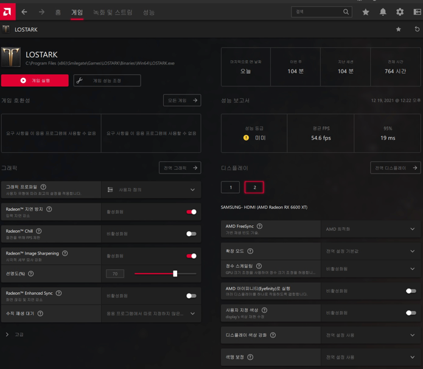

CRUD API 작성함에 있어 GET, POST, PUT 과 같은 메소드들은 일반적으로 잘 작성하는 듯 하나 PATCH 메소드의 경우 어떻게 작성해야 하는지 감이 안오는 경우가 있습니다.
이번 기회에 제가 생각하는 기준으로 어떻게 작성해야하는지 정리해보도록 하겠습니다.

# 문제 상황 정의

null 로 비즈니스로직을 처리할 수 있는 예시 화면을 가져와 봤습니다.


Image Sharpening 을 활성화됨 상태로 On 하고 선명도를 조절할 수 있는것으로 확인되는데요 

하나의 변수로 선명도를 나타내고 null 로 비활성화를 나타내도록 가정해보겠습니다.

다음과 같이 PUT API 를 작성할 수 있습니다.

```kotlin
data class UpdateOptionReq(
    val definition : Int? // 선명도
    ...
) {
    fun toUpdateParams() = OptionUpdateParams(
        definition = this.definition,
        // ...
    )
}

@PutMapping
fun update(@RequestBody req: UpdateOptionReq) {
    //...
    userOptionService.update(req.toUpdateParams())
    //...
}

data OptionUpdateParams(
    val definition: Int?,
    val other: Int?
    // ...
)

@Entity
class UserOption() {
    // ...
    fun updateBy(toBe: OptionUpdateParams) {
        this.definition = toBe.definition // null 은 null 로 설정합니다.
        this.other = toBe.other
        // ...
    }
}

```

# 추가 요구 사항 - 1

위에서 보여드린 창을 통해서 선명도를 조절할 뿐만 아니라 

게임중에 단축키로 선명도 부분만 조절할 수 있는 기능이 추가되어야 한다고 가정해보겠습니다.

단축키로 해당 선명도만 조절할 수 있어야 하니 Patch API 로 선명도 부분만 업데이트 되도록 API 를 작성해보겠습니다.

## Patch API 작성

```kotlin
data class UpdateDefinition(
    val definition: Int?
) {
    fun toUpdateParams() = OptionUpdateParams(
        definition = this.definition,
        other = null
    )
}

@PatchMapping("/definition")  
fun update(@RequestBody req: UpdateDefinition) {
    //...
    userVolumeService.update(req.toUpdateParams())
    //...
}
```

위와 같이 작성한다고 하면 어떤 사이드 이펙트가 발생할 수 있을까요??

우선 Patch API 작성자는 OptionUpdateParams 에 definition 만 넣었을 경우 definition 값만 업데이트 되도록 기대했을 수 있습니다.
하지만 엔티티의 update 로직을 보면 null 로 들어간 값은 전부다 '비활성화' 처리가 되어 다른 모든 옵션을 끄게되는 불상사가 발생하게 됩니다.


## 버그 수정

그럼 기존 엔티티의 업데이트 메소드 외에 patch 전용 메소드를 하나 추가해서 처리하도록 해보겠습니다.

```kotlin
@Entity
class UserOption() {
    // ...
    fun updateBy(toBe: OptionUpdateParams) {
        // ...
    }
    
    fun updateDefinition(toBe: Int?) {
        this.definition = toBe
    }
}
```
메소드를 추가한 현재 UserOption 엔티티는 기능적으로 문제가 되는 부분은 없어보입니다. 하지만
코드 품질로 봤을 때 메소드 각각이 모든 프로퍼티를 사용하고 있지 않아 코드의 응집성이 낮다고 볼 수 있습니다.

# 추가 요구 사항 - 2

이번에는 게이머의 추가 요청사항으로 단축키로 'other' 를 조절 할 수 있게 해달라는 요구사항이 왔습니다..

똑같이 API 를 만들어 보겠습니다.

## Patch API 작성

```kotlin
data class UpdateDefinitionOther(
    val other: Int?
) {
    fun toUpdateParams() = OptionUpdateParams(
        definition = null,
        other = this.other
    )
}

@PatchMapping("/other")  
fun update(@RequestBody req: UpdateDefinitionOther) {
    //...
    userVolumeService.update(req.toUpdateParams())
    //...
}
// 기존 PUT 요청 API
// 기존 PATCH definition 업데이트 API 

@Entity
class UserOption() {
    // ...
    fun updateBy(toBe: OptionUpdateParams) {
        // ...
    }
    
    fun updateDefinition(toBe: Int?) {
        // ...
    }
    
    fun updateOther(toBe: Int?) {
        this.other = toBe
    }
}

```

## 문제상황

위와 같은 요구사항이 추가될 때마다 도메인의 메소드는 하나씩 추가해야하고 API 도 하나씩 추가해야합니다.

프론트, 백엔드 개발자 입장에서는 관리해야할 API 가 추가되는 것이며 도메인 엔티티의 테스트 코드도 계속 추가되어야 할것입니다. 

위와 같은 문제상황을 null 을 도메인 로직을 뜻하는 '비활성화'로 사용하지 않음으로써 
어떻게 깔끔하게 정리하는지 보도록 하겠습니다.


# 리팩토링

도메인 로직의 응집성을 높이면서 관리해야할 API 수를 늘리지 않도록 해보겠습니다.

## PUT 요청에서 Null 제거
```kotlin
/* 기존 코드
data class UpdateOptionReq(
    val definition : Int? // 선명도
    ...
) {
    fun toUpdateParams() = OptionUpdateParams(
        definition = this.definition,
        // ...
    )
}
*/

data class UpdateOptionReq(
    val definition: Definition,
    val other: Other
) {
    data class Definition(
        val enable: Boolean,
        val per: Int,
    )
    data class Other(
        val enable: Boolean,
        val per: Int,
    )
    
    fun toUpdateParams() = OptionUpdateParams(
        definition = if (this.definition.enable) this.definition.per else null,
        other = if (this.other.enable) this.other.per else null, 
        // ...
    )
}

```


## 도메인 엔티티 응집성 향상

```kotlin
@Entity
class UserOption() {
    // ...
    fun updateBy(toBe: OptionUpdateParams) {
        // null 을 도메인 로직에 사용하는 것이 아닌 값의 부재에 사용함
        this.definition = toBe?.definition ?: this.definition
        this.other = toBe?.other ?: this.other
    }
/* 주석 처리    
    fun updateDefinition(toBe: Int?) {
        // ...
    }
    
    fun updateOther(toBe: Int?) {
        this.other = toBe
    }
*/
}
```
updateBy 메소드 하나로 모든 프로퍼티의 변경을 담당함으로 코드의 응집성이 향상된것을 확인할 수 있습니다.

## PATCH API 통합  (definition, other)

```kotlin
/*
data class UpdateDefinition(
    val definition: Int?
) {
    fun toUpdateParams() = OptionUpdateParams(
        definition = this.definition,
        other = null
    )
}

data class UpdateDefinitionOther(
    val other: Int?
) {
    fun toUpdateParams() = OptionUpdateParams(
        definition = null,
        other = this.other
    )
}
*/

// new
data class UpdateParams(
    val definition: Definition?
    val other: Other?
) {
    fun toUpdateParams() = OptionUpdateParams(
        definition = this.definition,
        other = this.other
    )
}
@PatchMapping 
fun update(@RequestBody req: UpdateParams) {
    //...
    userVolumeService.update(req.toUpdateParams())
    //...
}
```

위와 같이 변경하면 추가적인 요청사항이 있을 때 마다 해당 Patch 하나를 사용해서 처리를 할 수 있습니다.

# 결론

코드의 응집성 향상 및 추가적인 요구사항에 유연하게 처리할 수 있게 되었습니다. 위에서 진행한 리팩토링 외에도

추가적으로 진행하면 좋은것들이 있는데요 Definition, Other class 를 도메인 엔티티에 넣음으로써 
추가 리팩토링(validation)을 진행할 수 있습니다.

도메인 엔티티로 옮기면 좋은점들은 [다음 블로그](https://cheese10yun.github.io/spring-jpa-best-04/) 에서 확인가능합니다.


