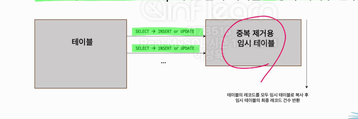

> 강의 내용 중 필요하다고 생각되는 부분과 개인적인 생각을 포함했습니다.

# MySQL 성능 최적화 가이드

## TEXT VS VARCHAR

데이터 조회 시 주의사항:

- 대용량 컬럼이 불필요한 경우 SELECT 시 제외하고 쿼리하기
- 큰 데이터가 있는 경우 Off-Page 저장으로 인해 성능 저하 가능
- 대용량 컬럼을 자주 조회해야 하는 경우 Redis 같은 캐시 솔루션 고려

## Count(*) & Select * 비교

### 쿼리 예시

```sql
/* Count 쿼리 */
SELECT COUNT(*) FROM table WHERE ix_fd = 'A' AND non_ix_fd = 'B';

/* All 쿼리 */
SELECT * FROM table WHERE ix_fd = 'A' AND non_ix_fd = 'B';
```

두 쿼리의 특징:
- 네트워크 트래픽을 제외하면 거의 동일한 성능
- 처리 과정:
    1. 인덱스된 ix_fd로부터 레코드 조회
    2. non_ix_fd 비교를 위한 테이블 액세스 수행

### Covering Index 활용

> **Covering Index**: 쿼리 실행에 필요한 모든 데이터를 인덱스에서 가져오는 방식

최적화된 쿼리 예시:
```sql
SELECT COUNT(*) WHERE ix_fd = 'A' AND ix_fd = 'B';
-- 또는
SELECT COUNT(ix_fd) WHERE ix_fd = 'A';
```

주의사항:
- 실제 환경에서는 인덱스 컬럼만으로 Count 쿼리를 구성하기 어려움
- 모든 컬럼을 인덱스로 만드는 것은 권장되지 않음

## Count(*) & Count(DISTINCT)

특징 비교:
- **Count(*)**: 단순 레코드 수 확인
- **Count(DISTINCT)**: 임시 테이블 생성 후 중복 제거된 레코드 수 확인



### Count(*) 최적화 방법

1. 불필요한 쿼리 제거
2. 대략적인 건수 활용
3. WHERE 조건이 없는 경우 INFORMATION_SCHEMA.TABLES 활용

## 페이징 쿼리 최적화

> [JPA에서 Page 쿼리 성능 최적화](https://cheese10yun.github.io/page-performance/)

### LIMIT & OFFSET 문제점

- DBMS가 순차적으로 레코드를 읽어야 함
- OFFSET이 커질수록 성능 저하
- 전체 레코드를 읽는 것보다 비효율적

### 최적화 방법

#### 1. 범위 기반 방식
- 배치, 데이터 마이그레이션 등에 적합
- 1회차와 N회차 쿼리 형태가 동일

```sql
SELECT *
FROM table
WHERE id BETWEEN 100 AND 200;

SELECT *
FROM table
WHERE data BETWEEN '2020-01-01' AND '2020-01-31';
```

#### 2. 데이터 개수 기반 방식
첫 조회와 이후 쿼리를 분리하여 처리

예시 데이터:

| finished_at | id |
|-------------|-----|
| 2020-01-01  | 5   |
| 2020-01-01  | 1   |
| 2020-01-01  | 2   |
| 2020-01-01  | 3   |
| 2020-01-02  | 8   |

쿼리 구현:
```sql
/* 첫 조회 쿼리 */
SELECT *
FROM table
WHERE finished_at >= "시작날짜"
  AND finished_at < "종료날짜"
ORDER BY finished_at, id
LIMIT 30;

/* 이후 쿼리 */
SELECT *
FROM table
WHERE (finished_at = "이전 마지막 데이터의 날짜 값" AND id > "이전 데이터의 ID")
   OR (finished_at > "이전 마지막 데이터의 날짜 값" AND finished_at < "종료날짜")
ORDER BY finished_at, id
LIMIT 30;
```

**주의**: 이전 데이터의 ID만 WHERE 조건으로 사용하면 데이터 누락 가능성 있음

## Stored Function

### MySQL Function 종류

1. Built-in Function
2. User Defined Function
3. Stored Function

### Stored Function 특징

#### Deterministic Function
- 동일한 인자에 대해 항상 동일한 결과 반환
- Primary key 읽을 때 const 타입으로 처리
- 실행계획에서 재수행되지 않아 성능이 좋음

#### Not Deterministic Function
- 동일한 인자에 대해 결과가 다를 수 있음
- Primary key 읽을 때 All 타입으로 처리
- Index를 사용하지 못하고 Full Scan 발생
- 대표적인 예: RAND(), NOW(), UUID(), SYSDATE()
    - NOW()는 하나의 Statement 내에서는 Deterministic처럼 동작

### 주의사항

- 기본값은 NOT DETERMINISTIC
- DEFINER: Stored Function 소유자 지정 옵션
- SQL Security: 실행 권한 지정 (INVOKER 권장)

## Lateral Derived Table

LATERAL은 FROM 절에서 파생 테이블이나 테이블 함수가 이전 항목을 참조할 수 있게 하는 기능입니다.

## SELECT .. FOR UPDATE

[공유 락(Shared Lock)과 배타 락(Exclusive Lock)](https://hudi.blog/mysql-8.0-shared-lock-and-exclusive-lock/)

### 특징

- 격리 수준과 무관하게 최신 커밋 데이터 조회
- Exclusive Lock 사용
- 원격 시스템 처리 시 트랜잭션이 길어질 수 있음

### 권장사항

- WHERE 조건을 최대한 구체적으로 사용
- 트랜잭션 시간 최소화

## SELECT .. FOR SHARE

### 사용 예시
부모-자식 테이블 관계에서 데이터 정합성 유지:

```sql
BEGIN;
SELECT * FROM article WHERE id = 1 FOR SHARE;

IF (article.canAddComment()) {
   INSERT INTO comment (article_id, content) VALUES (1, 'comment');
   COMMIT;
} ELSE {
    ROLLBACK;
}
```

### 주의사항
- Article 수정이 필요한 경우 처음부터 FOR UPDATE 사용 권장
- FOR SHARE에서 FOR UPDATE로의 잠금 업그레이드는 데드락 위험

## JPA Optimistic Lock VS Pessimistic Lock

### 락 유형 비교

**Optimistic Locking**:
- 데이터 변경 시점에 잠금
- Application Level에서 구현 필요
- 충돌이 적은 경우에 적합

**Pessimistic Locking**:
- 데이터 조회 시점에 잠금
- MySQL 서버에서 직접 지원
- 충돌이 많은 경우에 적합

> [자세한 내용 참고](https://seongwon.dev/Spring-MVC/20230430-%EB%B9%84%EA%B4%80%EC%A0%81%EB%9D%BD%EA%B3%BC_%EB%82%99%EA%B4%80%EC%A0%81%EB%9D%BD/)

## Generated Column

### 유형과 특징

#### 1. Virtual Column
- 실시간 계산된 값 반환
- 디스크에 저장하지 않음
- 레코드 읽기 전 또는 BEFORE 트리거 실행 직후 계산

```sql
CREATE TABLE t1 (
    a INT,
    b INT,
    c INT AS (a + b) VIRTUAL
);
```

특징:
- 인덱스 생성 가능 (인덱스는 디스크에 저장)
- 일반 칼럼과의 상호 변환 불가

#### 2. Stored Column
- 계산된 값을 실제로 저장
- 삽입/갱신 시 계산하여 저장
- 인덱스 생성 가능

```sql
CREATE TABLE t1 (
    a INT,
    b INT,
    c INT AS (a + b) STORED
);
```

특징:
- 일반 칼럼과 상호 변환 가능

## 함수 기반 인덱스

함수나 표현식의 결과값을 인덱스로 생성하는 방식

### 활용 사례

#### 1. 문자열 처리
```sql
-- 대소문자 구분 없는 검색
CREATE INDEX idx_name ON table_name (LOWER(column_name));

-- 이메일 도메인 검색
CREATE INDEX idx_email ON user (SUBSTRING(email, '@', -1));
```

#### 2. 날짜 처리
```sql
-- 월별/연도별 검색 최적화
CREATE INDEX idx_month ON table (MONTH(date));
CREATE INDEX idx_year ON table (YEAR(date));
```

#### 3. 해시값 검색
```sql
CREATE INDEX idx_hash ON table (MD5(column));
```

### 주의사항

1. 실행 계획 확인 필수
2. 데이터 타입 명확히 지정
   ```sql
   -- double 타입 예시
   SELECT * FROM table WHERE (col1 + col2) < CAST(1000 AS DOUBLE);
   ```
3. 표현식 결과 타입 확인 방법:
   ```sql
   SELECT MONTH('2024-01-01') AS EXPR_RESULT;
   ```

### 제한사항
- 일반 인덱스보다 추가 계산 비용 발생
- Non-Deterministic Function 사용 불가
- 공간/전문검색 인덱스 미지원
- Primary Key에 표현식 포함 불가

## 에러 핸들링

### 에러 유형
1. Global Error (1-999)
2. Server Error (1000-1999, 3000+)
3. Client Error (2000-2999)

### MySQL 에러 구성요소

#### 1. Error No
- Global Error: 1-999
- Server Error: 1000-1999, 3000+
- Client Error: 2000-2999

#### 2. SQLState
5자리 문자열 구조:
- 00: 성공
- 01: 경고
- 02: No Data
- HY: 벤더 의존적 상태값
- 기타: 에러

#### 3. Error Message
- 사람이 읽을 수 있는 형태
- 버전별로 변경될 수 있어 에러 처리에 사용 지양

### 에러 처리 권장사항
- SQLState 기반 처리 권장 (ANSI SQL 표준)
- HY 상태값은 ErrorNo와 함께 사용
- Error Message 기반 처리 지양

## LEFT JOIN 주의사항 & 튜닝

### 예시 데이터

| 테이블명     | 전체 데이터    | 상세                  |
|-----------|------------|---------------------|
| user      | 30,000 rows | -                   |
| user_coupon| 100,000 rows| coupon_id=1: 1,000  |
|           |            | coupon_id=2: 1,000  |
|           |            | coupon_id=3: 1,000  |

### JOIN 동작 방식 비교

#### 데이터 연결
```sql
SELECT *
FROM user u
LEFT JOIN user_coupon uc 
    ON u.id = uc.user_id 
    AND uc.coupon_id = 1;
```
- 결과: 30,000 rows (0.04 sec)
- 역할: 데이터 연결

#### 데이터 필터링
```sql
SELECT *
FROM user u
LEFT JOIN user_coupon uc 
    ON u.id = uc.user_id
WHERE uc.coupon_id = 2;
```
- 결과: 1,000 rows (0.00 sec)
- 역할: 데이터 필터링
- 특징: INNER JOIN과 동일한 효과

### 실행 계획 특징

**LEFT JOIN**:
- FROM 테이블 먼저 full scan
- 이후 참조 데이터 검색

**INNER JOIN**:
- Optimizer가 참조 테이블 먼저 검색
- 필터링 후 데이터 연결

### 최적화 팁
- COUNT(*) 쿼리에서 불필요한 JOIN 제거
- JOIN 조건은 ON절에 명시 (IS NULL 조건 제외)
- LEFT JOIN과 INNER JOIN의 특성을 고려하여 선택

## Prepared Statement

### 기본 사용법
```java
pstmt = connection.prepareStatement("SELECT * FROM matt WHERE id=?");
pstmt.setInt(1, 1234);
rs = pstmt.executeQuery();
```

### 장단점

#### 장점
- SQL Injection 방지
- 쿼리 파싱 비용 감소

#### 단점
- 메모리 사용량 증가
- MySQL에서는 Parse Tree만 캐시 (실행 계획 제외)
- Connection 단위 캐시

### 캐시 방식

1. Client Side PreparedStatement
2. Server Side PreparedStatement

> [상세 비교 참조](https://stackoverflow.com/questions/32286518/whats-the-difference-between-cacheprepstmts-and-useserverprepstmts-in-mysql-jdb)

### Server Side 사용 시 고려사항

메모리 사용량 예시:
- 전체 커넥션: 5,000개
- 필요 쿼리 패턴: 100개
- 필요 PS 객체: 500,000개
- 기본 max_prepared_stmt_count: 16,382

### 사용 권장사항

1. 쿼리 복잡도에 따른 선택:
    - 단순 쿼리: PreparedStatement 미사용 권장
    - 복잡한 쿼리: PreparedStatement 사용 권장

2. 리소스 고려:
    - AWS RDS 환경(db.t3.medium, db.r5.large)에서는 메모리가 제한적
    - CPU vs 메모리 사용량 균형 필요

### 주의사항
- Server-side PreparedStatement의 부작용 주의
- ORM 애플리케이션의 단순 쿼리 특성 고려
- 성능 향상이 제한적일 수 있음
- max_prepared_stmt_count 부족 시 효과 감소

## SQL 문장의 가독성 향상

### 1. DISTINCT 사용법
```sql
/* 지양할 형태 */
SELECT DISTINCT (column) FROM table;

/* 권장 형태 */
SELECT DISTINCT column FROM table;
```

### 2. LEFT JOIN 작성 규칙
- 조인 대상 테이블 조건은 ON절에 명시
- WHERE절 사용 시 INNER JOIN과 동일 효과
- 불필요한 LEFT JOIN 제거 (단순 SELECT/COUNT 등)

### 3. ORDER BY와 LIMIT
- ORDER BY 없는 LIMIT 사용 지양
- 페이지네이션 시 반드시 ORDER BY 포함

### 4. FULL Group By 형식
```sql
/* 지양할 형태 */
SELECT column1, column2 
FROM table 
GROUP BY column1;

/* 권장 형태 */
SELECT column1, SUM(column2), COUNT(*) 
FROM table 
GROUP BY column1;
```

### 5. 논리 연산자 사용
- AND/OR 조건 혼용 시 괄호 필수

### 6. COUNT 사용법
```sql
/* 지양할 형태 */
COUNT(1), SUM(1), COUNT(pk_col), COUNT(not_null_col)

/* 권장 형태 */
COUNT(*)
```
