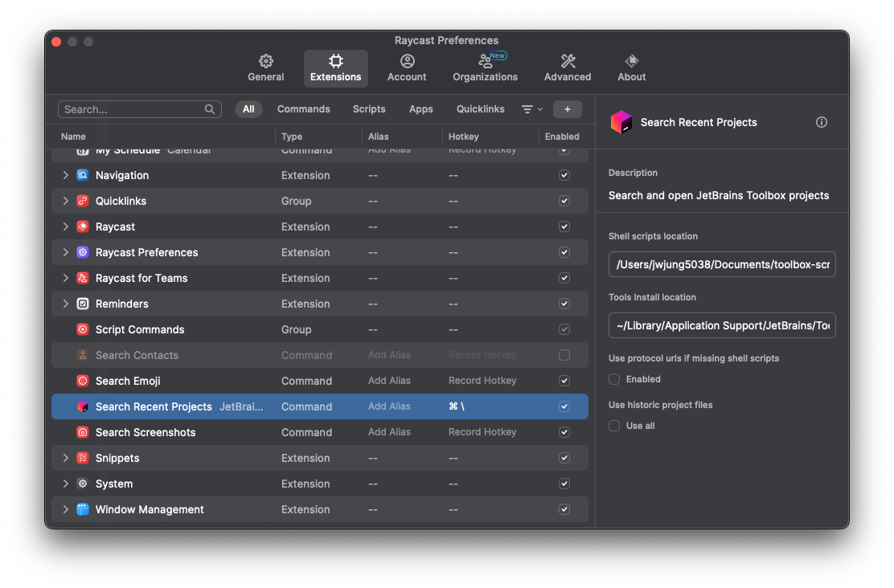
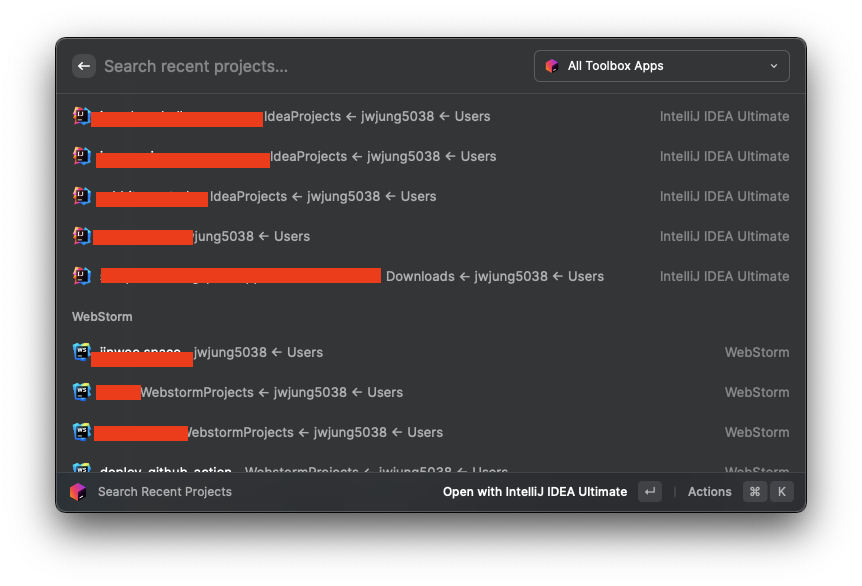
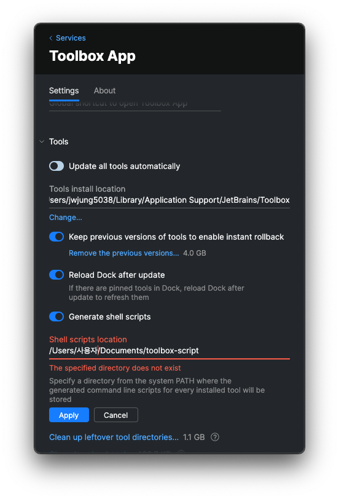
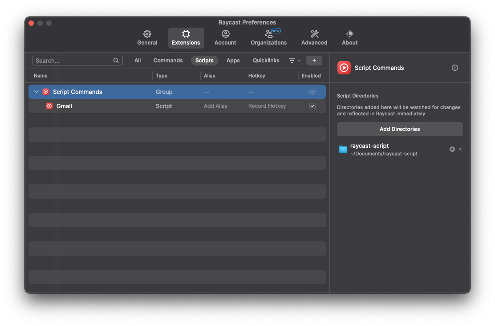

# Raycast: Mac OS용 생산성 향상 도구

Raycast는 Mac OS에서 사용할 수 있는 Launcher 애플리케이션입니다. Alfred의 유료 기능인 스크립트 자동화 등을 무료로 사용할 수 있어 개발자들 사이에서 인기를 끌고 있죠.

Raycast의 가장 큰 장점은 다양한 기능을 플러그인 형태로 제공한다는 점입니다. 기본으로 제공되는 플러그인도 많지만, 사용자가 직접 플러그인을 만들어 배포할 수도 있어 확장성이 뛰어납니다.
## Raycast 설치하기

Homebrew를 사용하여 간단하게 설치할 수 있습니다

```shell
brew install --cask raycast
```

## 개발 생산성을 높여주는 Raycast 플러그인

### 1. 프로젝트 빠르게 열기: Jetbrains 플러그인
여러 마이크로서비스로 나누어 개발하거나 프론트엔드와 백엔드를 동시에 개발하는 경우, Jetbrains의 Toolbox를 사용해 일일이 프로젝트를 찾아 클릭하는 것은 매우 번거로운 작업입니다.

이때 Raycast의 Jetbrains 플러그인을 활용하면 단축키를 통해 프로젝트를 빠르게 열 수 있습니다. 플러그인 설치 후 Toolbox의 Shell scripts 위치와 Toolbox 위치를 지정해주기만 하면 됩니다.

Toolbox의 쉘 스크립트 생성 및 위치 지정 방법은 Toolbox 설정 페이지에서 할 수 있습니다.





다음과 같이 바로 실행 할 수 있습니다.

추가로 Toolbox의 쉘 스크립트 생성 및 위치 지정하는 방법은 Toolbox 의 해당 설정 페이지에서 설정할 수 있습니다.



### Gmail 더 빠르게 열기: 쉘 스크립트 활용

Raycast는 쉘 스크립트 실행도 지원합니다. Gmail을 바로 열 수 있는 쉘 스크립트를 작성하고, Raycast에서 실행할 수 있도록 설정해봅시다.

먼저 다음 명령어로 스크립트를 작성합니다
```shell
cd ~/Documents
mkdir raycast-scripts
cd raycast-scripts
vim google-gmail.sh
```
스크립트 내용은 다음과 같습니다 (출처: lajlev/raycast-my-scripts)

```
#!/bin/bash

# @raycast.title Gmail
# @raycast.author Michael Aigner
# @raycast.authorURL https://github.com/tonka3000
# @raycast.description Open gmail.com in the default browser

# @raycast.icon images/google-gmail-logo.png
# @raycast.mode silent
# @raycast.packageName Google
# @raycast.schemaVersion 1

open https://gmail.com
``` 

그 다음 Raycast 설정에서 방금 만든 디렉토리를 포함시켜줍니다.



이제 Cmd + Space를 누르고 gmail을 입력하면 Gmail을 빠르게 실행할 수 있습니다.


## 마치며
Raycast의 다양한 플러그인을 활용하면 개발 생산성을 크게 높일 수 있습니다.
앞서 소개한 플러그인 외에도 Raycast Store에 유용한 플러그인이 많습니다. 

- [tailwind size converter](https://www.raycast.com/kemiljk/tailwind-size-conversion) 테일윈드 처음에 사용할 때 px 간 변환히 힘들 때 자주사용함
- 