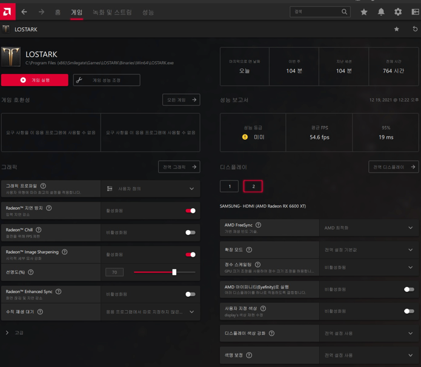

# 들어가며

CRUD API를 작성할 때, GET, POST, PUT과 같은 메서드는 일반적으로 잘 작성하지만, PATCH 메서드의 경우 어떻게 작성해야 할지 감이 오지 않을 때가 있습니다. 이번 글에서는 제가 생각하는 기준으로
Kotlin과 Spring WebMVC를 사용하여 PATCH API를 효율적으로 작성하는 방법에 대해 알아보겠습니다.

# 문제 상황 정의

아래 이미지와 같이 Image Sharpening을 활성화하고 선명도를 조절할 수 있는 설정 화면이 있다고 가정해봅시다.



하나의 변수로 선명도를 나타내고, null로 비활성화를 나타내도록 한다면, 다음과 같이 PUT API를 작성할 수 있습니다:

```kotlin
data class UpdateOptionReq(
    val definition: Int? // 선명도
    // ...
) {
    fun toUpdateParams() = OptionUpdateParams(
    definition = this.definition,
    // ...
    )
}

@PutMapping
fun update(@RequestBody req: UpdateOptionReq) {
    // ...
    userOptionService.update(req.toUpdateParams())
    // ...
}

data class OptionUpdateParams(
    val definition: Int?,
    val other: Int?
    // ...
)

@Entity
class UserOption {
    // ...
    fun updateBy(toBe: OptionUpdateParams) {
        this.definition = toBe.definition // null은 null로 설정합니다.
        this.other = toBe.other
        // ...
    }
}
```

# 추가 요구사항 - 1

위 설정 창을 통해 선명도를 조절할 뿐만 아니라, 게임 중에 단축키로 선명도만 조절할 수 있는 기능이 추가되어야 한다고 가정해봅시다.
이를 위해 PATCH API로 선명도 부분만 업데이트되도록 작성해보겠습니다.

```kotlin
data class UpdateDefinition(
    val definition: Int?
) {
    fun toUpdateParams() = OptionUpdateParams(
        definition = this.definition,
        other = null
    )
}

@PatchMapping("/definition")
fun update(@RequestBody req: UpdateDefinition) {
    // ...
    userOptionService.update(req.toUpdateParams())
    // ...
}
```

하지만 이렇게 작성하면 의도치 않은 side effect가 발생할 수 있습니다. PATCH API 작성자는 `definition`만 업데이트되기를 기대했겠지만, 엔티티의 update 로직을 보면 null로 들어간
값은 모두 '비활성화' 처리되어 다른 모든 옵션이 꺼지게 됩니다.

이를 해결하기 위해 기존 엔티티의 `updateBy` 메서드 외에 PATCH 전용 메서드를 추가해봅시다:

```kotlin
@Entity
class UserOption {
    // ...
    fun updateBy(toBe: OptionUpdateParams) {
        // ...
    }

    fun updateDefinition(toBe: Int?) {
        this.definition = toBe
    }
}
```

이제 기능적으로는 문제가 없어 보이지만, 메서드 각각이 모든 프로퍼티를 사용하고 있지 않아 코드의 응집성이 낮아졌습니다.

# 추가 요구사항 - 2

게이머의 추가 요청으로 단축키로 'other'를 조절할 수 있게 해달라는 요구사항이 왔습니다. 마찬가지로 PATCH API를 작성해보면:

```kotlin
data class UpdateOther(
    val other: Int?
) {
fun toUpdateParams() = OptionUpdateParams(
        definition = null,
        other = this.other
    )
}

@PatchMapping("/other")
fun update(@RequestBody req: UpdateOther) {
    // ...
    userOptionService.update(req.toUpdateParams())
    // ...
}

@Entity
class UserOption {
// ...
fun updateBy(toBe: OptionUpdateParams) {
        // ...
    }

    fun updateDefinition(toBe: Int?) {
        // ...
    }
    
    fun updateOther(toBe: Int?) {
        this.other = toBe
    }
}
```

이런 식으로 요구사항이 추가될 때마다 도메인의 메서드와 API를 하나씩 추가해야 합니다.
이는 프론트엔드와 백엔드 개발자 모두에게 관리 포인트가 늘어나는 것을 의미하며,
도메인 엔티티의 테스트 코드도 계속 추가되어야 합니다.

# 리팩토링

도메인 로직의 응집성을 높이면서 관리해야 할 API 수를 늘리지 않도록 리팩토링해봅시다.

## PUT 요청에서 Null 제거

```kotlin
data class UpdateOptionReq(
    val definition: Definition,
    val other: Other
) {
    data class Definition(
        val enable: Boolean,
        val value: Int,
    )
    data class Other(
        val enable: Boolean,
        val value: Int,
    )

    fun toUpdateParams() = OptionUpdateParams(
        definition = if (this.definition.enable) this.definition.value else null,
        other = if (this.other.enable) this.other.value else null, 
        // ...
    )
}
```

## 도메인 엔티티 응집성 향상

```kotlin
@Entity
class UserOption {
// ...
fun updateBy(toBe: OptionUpdateParams) {
        // null을 도메인 로직에 사용하는 것이 아닌 값의 부재에 사용함
        this.definition = toBe.definition ?: this.definition
        this.other = toBe.other ?: this.other
    }
}
```

`updateBy` 메서드 하나로 모든 프로퍼티의 변경을 담당함으로써 코드의 응집성이 향상되었습니다.

## PATCH API 통합 (definition, other)

```kotlin
data class UpdateParams(
    val definition: Definition?,
    val other: Other?
) {
fun toUpdateParams() = OptionUpdateParams(
        definition = this.definition?.value,
        other = this.other?.value
    )
}

@PatchMapping
fun update(@RequestBody req: UpdateParams) {
    // ...
    userOptionService.update(req.toUpdateParams())
    // ...
}
```

이제 추가적인 요청사항이 있을 때마다 이 PATCH API 하나로 처리할 수 있게 되었습니다.

# 마치며

이상으로 Kotlin과 Spring WebMVC를 사용하여 PATCH API를 효율적으로 작성하는 방법에 대해 알아보았습니다. null을 도메인 로직에 사용하지 않고 값의 부재를 나타내는 데 사용함으로써 코드의
응집성을 높일 수 있었고, 추가 요구사항에도 유연하게 대응할 수 있게 되었습니다.

여기서 한 걸음 더 나아가, `Definition`과 `Other` 클래스를 도메인 엔티티로 옮기면 유효성 검사(validation) 등의 추가 리팩토링을 진행할 수 있습니다. 도메인 엔티티로 옮기면 좋은
점들은 [이 블로그](https://cheese10yun.github.io/spring-jpa-best-04/)에서 확인할 수 있습니다.
