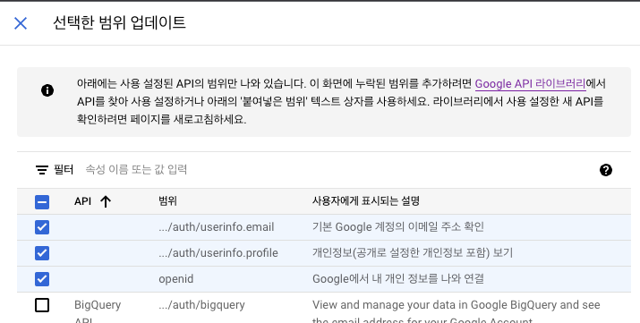
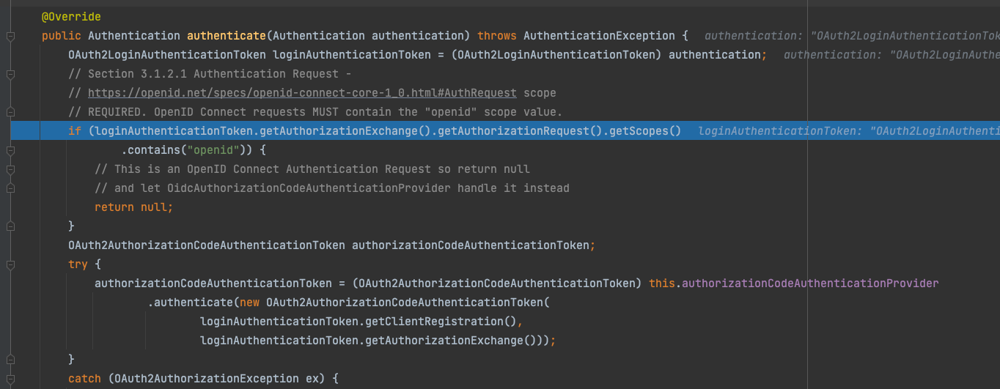

# Spring Boot OAuth2 Client와 Google 연동 시 openid scope 관련 에러

Spring Boot OAuth2 Client를 사용하여 Google과 연동할 때, 
scope에 ```openid```를 포함하면 ```CustomUserDetailsService```가 동작하지 않는 에러가 발생할 수 있습니다. 
이 글에서는 해당 에러의 발생 원인과 해결 방법을 알아보겠습니다.

## 에러 발생 원인



Google OAuth2 설정에서 다음과 같이 범위를 지정했습니다.

* email
* profile
* openid

그리고 Spring Boot 설정에서도 동일하게 scope를 지정했습니다.

```yaml
spring:
  security:
    oauth2:
      client:
        registration:
          google:
            client-id: ${GOOGLE_CLIENT_ID}
            client-secret: ${GOOGLE_CLIENT_SECRET}
            scope:
              - email
              - profile
              - openid
```

또한, ```CustomUserDetailsService```를 다음과 같이 구현했습니다.

```kotlin
@Service
class CustomUserDetailsService(
    private val memberRepository: MemberRepository
) :UserDetailsService{

    override fun loadUserByUsername(username: String): UserDetails {
        val member = memberRepository.findByEmail(username).orElseThrow {
            UsernameNotFoundException("해당하는 유저가 없습니다. : ${username}")
        }
        return MemberPrincipal.create(member)
    }
}
```

하지만 openid가 scope에 포함되어 있으면, 
기본적으로 적용된 ```OAuth2LoginAuthenticationProvider``` 클래스 내에서 등록한 ```CustomUserDetailsService가``` 동작하지 않고
다음 provider로 넘어가게 됩니다.



## 해결 방법
현재로서는 openid를 scope에서 제거하는 방법으로 해결할 수 있습니다. openid를 제거하면 CustomUserDetailsService가 정상적으로 동작합니다.

하지만 openid를 사용하는 것이 OAuth2와 OIDC(OpenID Connect)의 차이점과 관련이 있습니다. 
추후에 OAuth2와 OIDC의 차이점을 정리하여 더 자세히 알아보도록 하겠습니다.
