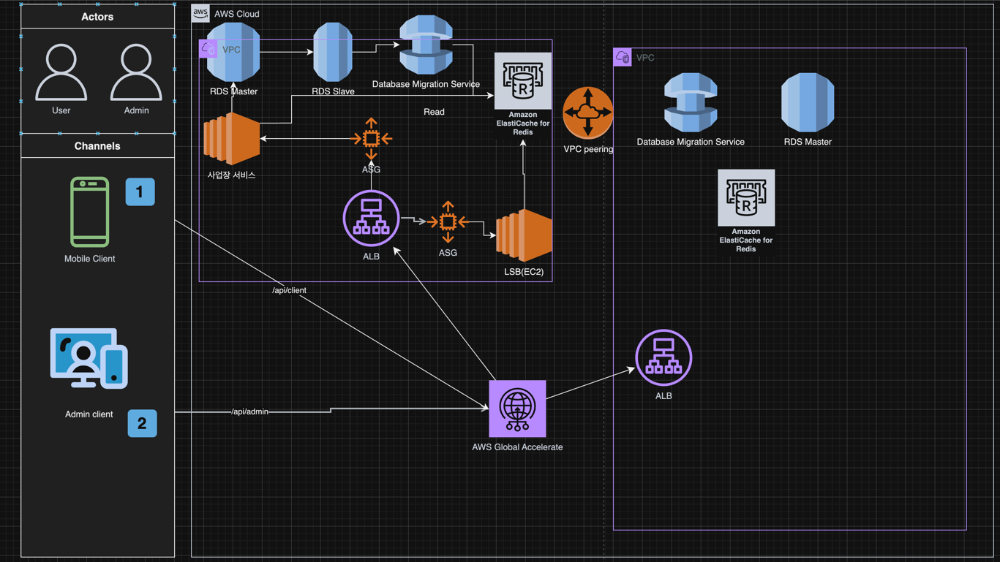

# 발표에 앞서

# 문제 이해 및 설계 범위 확정

## 기능 요구사항

1. 사용자의 위치(위도, 경도)와 검색 반경 정보(0.5KM, 1KM, ...) 입력 시, 해당 위치 반경 내의 사업장 정보 검색
2. 사업자 정보 등록, 수정, 삭제 기능 + 조회는 실시간 반영되지 않아도 무방
3. 사업장의 상세 정보를 조회하는 기능

## 비기능 요구사항

1. [GDPR, CCPA 준수](https://www.appsflyer.com/ko/trust/privacy/) -> 가장 가까운 리전을 사용해서 데이터 저장

광고 대행사에서 Appsflyer 를 통해서 데이터 수집을 하고 해당 데이터를 기반으로
마케팅 비용을 책정한 경험이 있음. 이에 따라 Appsflyer 를 연동하였는데,
연동하는 과정에서 사용자의 데이터를 굉장히 조심스럽게 수집한다는 느낌을 받음.

2. 낮은 응답지연 -> [AWS Global Accelerator](https://aws.amazon.com/ko/global-accelerator/) 활용

처음에는 AWS Route53의 지리적 위치 기반 라우팅이 있던데 그걸 사용하면 되는게 아닌가 했는데
AWS Global Accelerator 는 좀 더 풍부한 기능을 제공.

- 엣지 로케이션 뒤의 백본 네트워크 활용가능 -> 단일 리전에서 사용해도 좋아보임.
- Global IP 제공
- 자동 장애조치 및 트래픽 라우팅
- AWS Shield 기본 적용

AWS Global Accelerator 는 잘 몰랐을 때 ALB의 고정 IP 가 필요해서 사용해본 기억이 있다.
이런 기능들도 있었다는걸 깨달음.

3. 고가용성

AWS ASG, EKS 등 활용

# 개략적 설계안 제시 및 피드백

## 트래픽 분석

- 기본 데이터
    - DAU: 1억명
    - 사업장 수: 2억개
    - 사용자당 일일 검색 횟수: 5회
- 계산식
    - QPS = (1억 * 5회) / (24시간 * 60분 * 60초)
    - 결과: 약 5,000 QPS
- 특정 시간대 트래픽 집중
    - 피크 시간대
      사전 [AWS Warm pool](https://docs.aws.amazon.com/ko_kr/autoscaling/ec2/userguide/ec2-auto-scaling-warm-pools.html)
      고려

# 상세 설계

## API 설계

인증은 API 경로로 구분할 것이며 상세 설계에 포함되지는 않을 예정.

### Client API

```
GET /v1/search/nearby
```

### Admin API

```
GET    /v1/business/:id
POST   /v1/business
PUT    /v1/business/:id
DELETE /v1/business/:id
```

### 현재 이슈

- 읽기 위주 작업에 RDB 사용의 적절성 검토 필요
- 지리 데이터 처리를 위한 DB 선택
    - PostgreSQL + PostGIS 일반적 사용
    - NoSQL 등 대체 솔루션과 비교 분석 필요

### 아키텍처 방향

- Read/Write 분리 클러스터링
    - 최종 일관성 1일 이내 허용
    - Replication Lag 허용

### 서비스 분리

- Client-Service (사업장 서비스)
- Admin-Service (관리자 서비스)

## 알고리즘 선택 및 검토

### 2차원 검색

일반적으로 데이터베이 색인은 한 차원의 검색 속도만 개선 가능.
각각 한 차원씩 색인을 만들어두고 교집합을 검색하는 경우는 데이터의 양이 상당히 많아질 수 있음.

위도, 경도를 하나의 차원으로 색인을 만들 수 있는 방법이 있을까?

### 해시 - 균등 격자

지도를 균등하게 나누어서 색인을 만드는 방법.
한 차원으로 색인은 성공. 하지만 단점으로는 균등하게 나눠진 부분에서 사업장 분포가 균등하지 않을 수 있음.

### 해시 - 지오 해시

위도, 경도 데이터를 지오해시 알고리즘을 통해 1차원의 문자열로 변환.
이 때 문자열의 길이는 정확도를 결정. 

사업장 분포가 균등하지 않을 수 있나 인접한 지오해시로부터 점점 확장하면 됨. (상수 시간 해결)

솔루션: Redis GeoSpatial

> Spring Data Redis 를 사용해서 Redis Geospatial 을 사용할 수 있다.
> 많은 예제가 있어서 나중에 사용한다면 참고하면 좋을 것 같다.

단점:

- 접두사가 같으면 비슷한 위치에 있다. 하지만 그 역은 성립하지 않음.

```python
# 특정 지오해시가 주어졌을 때 주변의 지오해시를 계산하는 방법

def get_neighbor(geohash: str, direction: str) -> str:
    """
    주어진 지오해시의 특정 방향 인접 영역을 계산합니다.

    Args:
        geohash: 기준 지오해시 문자열
        direction: 방향 ('n','s','e','w','ne','nw','se','sw' 중 하나)

    Returns:
        str: 인접한 지오해시 문자열
    """

    # 지오해시 base32 인코딩 문자
    base32 = '0123456789bcdefghjkmnpqrstuvwxyz'

    # 각 문자의 이웃 관계 정의
    neighbors = {
        'n': ['bc01fg45238967deuvhjyznpkmstqrwx', 'p0r21436x8zb9dcf5h7kjnmqesgutwvy'],
        's': ['238967debc01fg45kmstqrwxuvhjyznp', '14365h7k9dcfesgujnmqp0r2twvyx8zb'],
        'e': ['p0r21436x8zb9dcf5h7kjnmqesgutwvy', 'bc01fg45238967deuvhjyznpkmstqrwx'],
        'w': ['14365h7k9dcfesgujnmqp0r2twvyx8zb', '238967debc01fg45kmstqrwxuvhjyznp']
    }

    border = {
        'n': ['bcfguvyz', 'prxz'],
        's': ['0145hjnp', '028b'],
        'e': ['prxz', 'bcfguvyz'],
        'w': ['028b', '0145hjnp']
    }

    # 대각선 방향은 두 방향의 조합
    if len(direction) == 2:
        return get_neighbor(get_neighbor(geohash, direction[0]), direction[1])

    last_ch = geohash[-1]  # 마지막 문자
    parent = geohash[:-1]  # 마지막 문자를 제외한 부분

    type_idx = len(parent) % 2

    # 경계에 있는 경우
    if last_ch in border[direction][type_idx]:
        parent = get_neighbor(parent, direction)

    # 이웃 문자 찾기
    next_idx = neighbors[direction][type_idx].find(last_ch)
    if next_idx < 0:
        next_idx = base32.find(last_ch)
        if next_idx < 0:
            return parent
    return parent + base32[next_idx]


# wydm2의 모든 인접 영역 계산
geohash = 'wydm2'

neighbors = {
    'n': get_neighbor(geohash, 'n'),
    'ne': get_neighbor(geohash, 'ne'),
    'e': get_neighbor(geohash, 'e'),
    'se': get_neighbor(geohash, 'se'),
    's': get_neighbor(geohash, 's'),
    'sw': get_neighbor(geohash, 'sw'),
    'w': get_neighbor(geohash, 'w'),
    'nw': get_neighbor(geohash, 'nw')
}

# 결과 출력
for direction, value in neighbors.items():
    print(f"{direction}: {value}")

```

> 표시할 사업장이 충분하지 않은 경우

1. 사용자의 지오해시로부터 인접한 지오해시 List 를 반환하고
2. 인접한 지오해시 List 에서 사업장을 찾는다.
3. 사업장이 충분하지 않은 경우 인접한 지오해시로부터 인접한 지오해시를 계속 찾는다.
4. 사업장이 충분해질 때까지 반복한다.

### 트리 - 쿼드 트리

어플리케이션이 시작할 때 말단 노드가 최소 사업장 갯수를 만족할 때까지 트리를 구축한다.

> 메모리 계산

1. 데이터베이스에 구축하는게 아니라 메모리 내부에 존재하기 때문에 메모리 계산이 중요.
2. Application Server 가 시작할 때 구축이 되어야 함.
3. 사용하는 메모리 크기는 얼마정도 될까?
    1. 말단 노드에 포함되어야할 사업장의 갯수는?
    2. 말단 노드, 내부 노드 각각의 크기를 우선 계산.
    3. 말단 노드, 내부 노드의 수를 계산.
        1. 말단 노드의 수 -> 요구사항에 달림. 전체의 값 중에 각 격자 안에 몇개의 값이 포함되어야 하는지?
        2. 내부 노드의 수 = 말단 노드의 수 * (1 / 3) [설명](https://www.acmicpc.net/board/view/65494)
    4. 말단 노드, 내부 노드의 크기를 곱해서 메모리 크기를 계산.

- 결론 -> 생각보다 많이 잡아먹지 않음.

> 탐색

1. 위도, 경도가 주어짐.
2. 2.루트 노드부터 각 좌상단, 우하단 좌표를 비교해서 말단 노드까지 내려감.
3. 말단 노드에 충분한 사업장 갯수가 있으면 반환, 그렇지 않다면 인접노드도 추가

> 주의사항

- 서버가 가동될 때 몇분간 트리 구축 시간이 소요됨 -> 한꺼번에 동시 업데이트 시 문제 발생가능성
- 장소가 추가될 때 실시간으로 트리 재구축 하는것이 어려움 ( 캐시무효화, 락 등의 문제 )

### 트리 - 구글 S2

- 구글 S2 는 지오펜스를 구현할 수 있다.
- 지오펜스는 어떤것?
    - 기본적인 주변 사업장 검색 지원
    - 관심있는 영역을 설정하고 해당 경계를 벗어나면 알림을 주는 게 가능.
        - 배민 기존 지역과 다른 지역에서 어플리케이션을 실행했을 때 다른지역이라고 알림을 주는것?이 될 수 있나?

> 개인적으로 사용한다면 지오해시를 사용할 것 같다.
>   - 상용 제품들이 많이 나와있음.
>   - 레퍼런스가 많음.
>   - 상대적으로 쿼드 트리보다 구축이 쉬워보임

## 지리 정보 테이블 구조 설계

1. Hash 와 business_ids

| geo hash | business_ids  |
|----------|---------------|
| 32feac   | 343, 123,     |
| f3lcad   | 456, 789, 111 |

2. Hash 와 business_id

| geo hash | business_id |
|----------|-------------|
| 32feac   | 343         |
| 32feac   | 123         |
| f3lcad   | 456         |
| f3lcad   | 789         |
| f3lcad   | 111         |

전자 보다 후자가 나은 이유

1. 생성 및 업데이트 비용이 적음.
2. 병렬적으로 갱신이 발생한다면 락을 고려해야해서 성능 저하가 발생할 수 있음.

## 지리 정보 색인 규모 확장

1. 샤딩을 진행하려면 실제 저장되는 데이터의 양을 고려해야함.
2. 지리 정보 색인은 전부 저장한다고해도 1.71G 밖에 안됨.
3. 이 경우 Read 데이터베이스를 늘리는게 좋은 판단.

## 캐시

캐시를 적용하려면 일단 캐시가 정말 필요한지 판단해야함.

"데이터 베이스 크기가 상대적으로 작다." -> 질의문은 I/O 에 좌우되지 않고 메모리 캐시와 비슷함.

위의 이유를 일단 기본적으로 생각해야함. 그래도 도입해야 판단이 된다면 비용 분석에 유의.

### 캐시 키

- 사용자의 위도 및 경도 -> 위치 정보는 추정치 이며 같은 자리라고 해도 다른 위도, 경도를 가질 수 있기 때문에 고려대상 X
- 사용자의 위도 및 경도를 기반으로 한 geo hash -> 사용자의 위치를 기반으로 한 캐시 키를 사용하는 것이 좋음.
    - Value 에 해당하는 작업장 정보는 자주 수정되지 않는다.
    - 검색 반경이 500m, 1km, 2km 여러가지가 존재. 모두 캐시적용 해놓아야함.

### 캐시 무효화

- 사업장 정보의 변경이 발생할 때 캐시를 무효화
    - 빈도수가 적기 때문에 락을 고려하지 않아도 됨.

## 지역 및 가용성 구역

- 여러 지역에 나눠서 설치
- 빠른 응답속도와 데이터보안의 이점이 존재.
- 위에서 언급한 AWS Global Accelerator 사용

## 추가질문

1. 현재 영업중인 사업장, 식당 정보만 받아오기 등의 요구사항 처리는 어떻게?
   사용자의 위치에 해당하는 geo hash 를 찾아서 모든 사업장을 가져온다. 해당하는 사업장들의 개수가 적기 때문에
   여기서 필터링하여 반환.

## AWS 아키텍처



# 마무리


