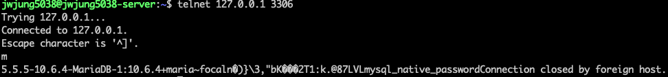

# MySQL 서버 네트워크 연결 확인하기
MySQL을 설치할 때 일반적으로 mysqld라고 불리는 서버 프로그램과 mysql-client 프로그램이 함께 설치됩니다. 
이 중 mysql-client는 DB에 접속하여 작업을 수행할 수 있는 클라이언트 프로그램입니다.

하지만 때로는 mysql-client와 같은 프로그램을 설치하지 않고, DB 서버의 네트워크 연결 상태만 확인하고 싶을 때가 있습니다. 
이런 경우 nc(netcat)나 telnet 명령어를 사용하면 간단하게 확인할 수 있습니다.


## nc (netcat) 사용하기
```nc``` 명령어를 사용하여 DB 서버의 IP 주소와 포트 번호를 지정하면 네트워크 연결 상태를 확인할 수 있습니다
```shell
nc 127.0.0.1 3306
```


위 예시에서는 로컬호스트(127.0.0.1)의 3306 포트(MySQL 기본 포트)에 접속을 시도합니다. 접속이 성공하면 MySQL 서버에서 보내는 응답 메시지를 확인할 수 있습니다.


## telnet 사용하기
```telnet``` 명령어를 사용하는 방법도 ```nc```와 유사합니다
```shell
telnet 127.0.0.1 3306
```


마찬가지로 로컬호스트의 3306 포트에 접속을 시도하고, 접속 성공 시 MySQL 서버의 응답 메시지를 확인할 수 있습니다.

## 정리
MySQL 클라이언트 프로그램 없이도 nc나 telnet 명령어를 사용하여 DB 서버의 네트워크 연결 상태를 간단하게 확인할 수 있습니다. 
이 방법은 DB 서버의 접속 가능 여부를 빠르게 테스트하거나, 방화벽 등의 네트워크 설정 문제를 진단할 때 유용하게 사용될 수 있습니다.


