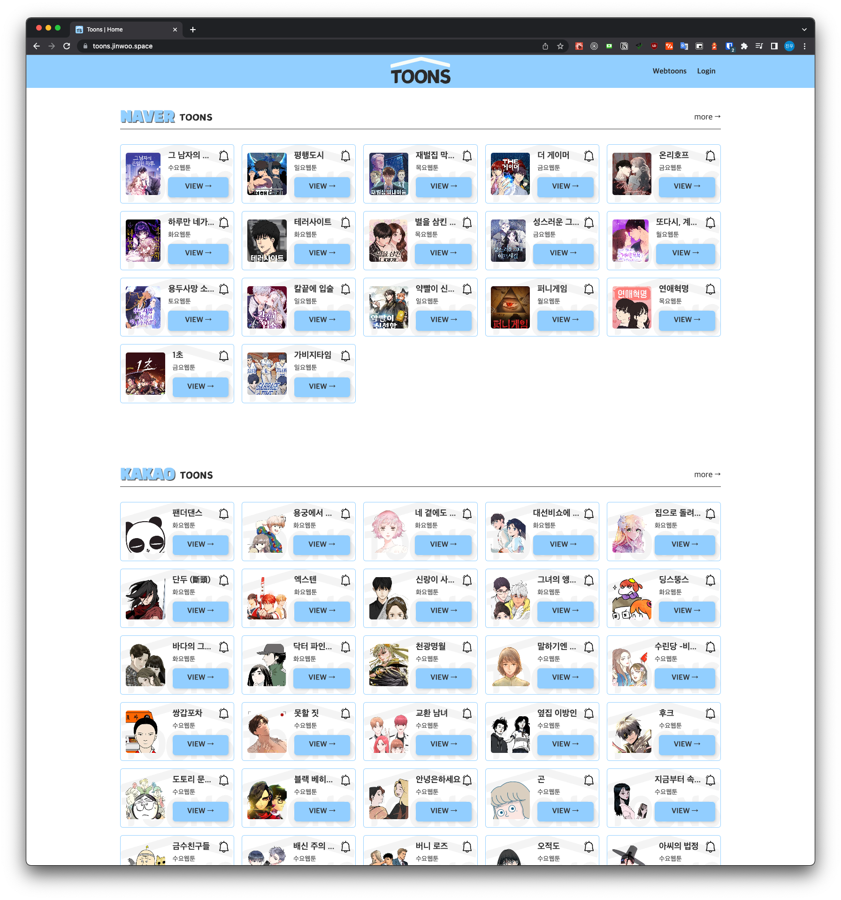
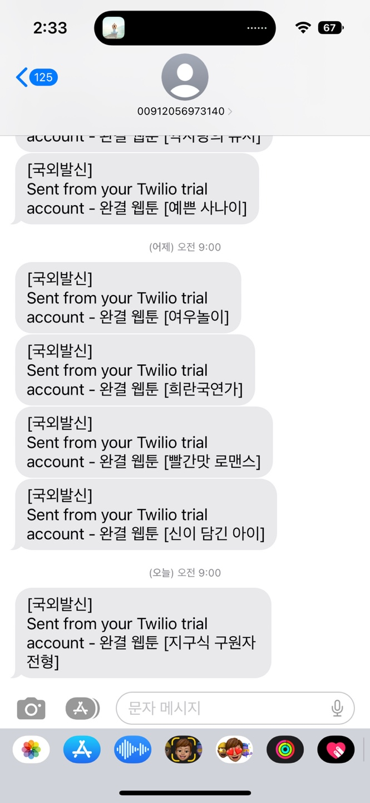

저는 현재 출퇴근 시간이 짧아 웹툰을 매일매일 챙겨보지 않고 정말 심심한 시간에 몰아서보는 편입니다. 그런데 웹툰을 몰아 볼 때 완결이 아니면 조금
짜증이 나는 상황이 있습니다. 그래서 제가 넷플릭스를 좋아하는 이유이기도 하구요.

그래서 제가 만들었습니다.

## 네이버, 카카오 완결웹툰 알림 

[바로가기](https://toons.jinwoo.space)

간단합니다. 회원가입 후 알림버튼을 누르기만 하면 매일 정각 9시에 해당 웹툰을 완결알림을 SMS를 통해 받으실 수 있습니다.

하지만 저는 Twilio 무료 SMS 를 사용하고 있기 때문에 사실 제가 휴대폰을 직접 등록해주지 않으면 발송이 안됩니다 ㅋㅋ

서버비도 미니컴퓨터 사서 직접 호스팅해서 사용하는 거지 주제에 Twilio 결제까지는 굳이? 라는 생각이 들어서입니다.

### 개발 과정

프론트 1명 백엔드 1명으로 작업하였고 저는 백엔드를 담당하였습니다.

백엔드 기술 스펙은 
* Spring boot
* JPA
* Redis, MariaDB
* 크롤링 (Jsoup)

자세한 코드는 다음 [Github](https://github.com/Jiinwoo/toons) 을 참고해주세요!
