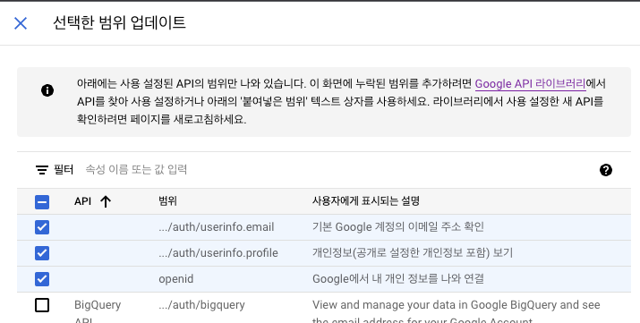
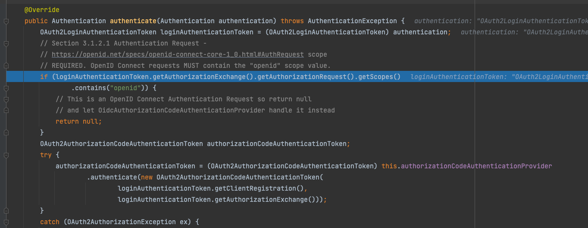

## 발생 원인



google oauth2 설정을 했을 때 다음과같이 범위를 지정하였습니다.

* email
* profile
* openid

이후

```yaml
spring:
  security:
    oauth2:
      client:
        registration:
          google:
            client-id: ${GOOGLE_CLIENT_ID}
            client-secret: ${GOOGLE_CLIENT_SECRET}
            scope:
              - email
              - profile
              - openid
```

다음과 같이 지정하였으며 

```kotlin
@Service
class CustomUserDetailsService(
    private val memberRepository: MemberRepository
) :UserDetailsService{

    override fun loadUserByUsername(username: String): UserDetails {
        val member = memberRepository.findByEmail(username).orElseThrow {
            UsernameNotFoundException("해당하는 유저가 없습니다. : ${username}")
        }
        return MemberPrincipal.create(member)
    }
}
```
다음과 같이 CustomUserDetails 를 반환하도록 구현하였습니다.

하지만 기본적으로 적용된 OAuth2LoginAuthenticationProvider 클래스 내에서
openid가 scope에 포함되어있으면
다음 부분에서 저희가 등록한 CustomUserDetailsService 가 동작하지 않고
다음 provider로 넘어가게 됩니다.



## 해결 방법

일단은 openid 를 제거하는 방법으로 해결했습니다.

추후에 OAuth2 와 OIDC 차이점을 정리해보겠습니다.
